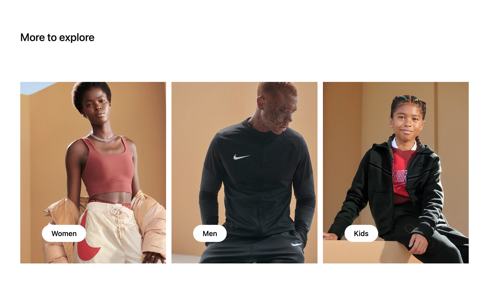
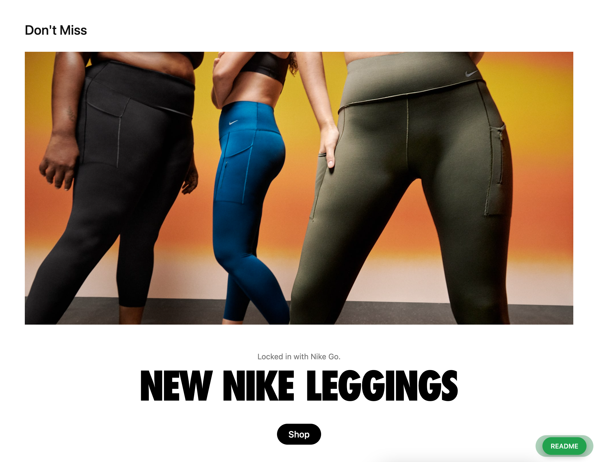
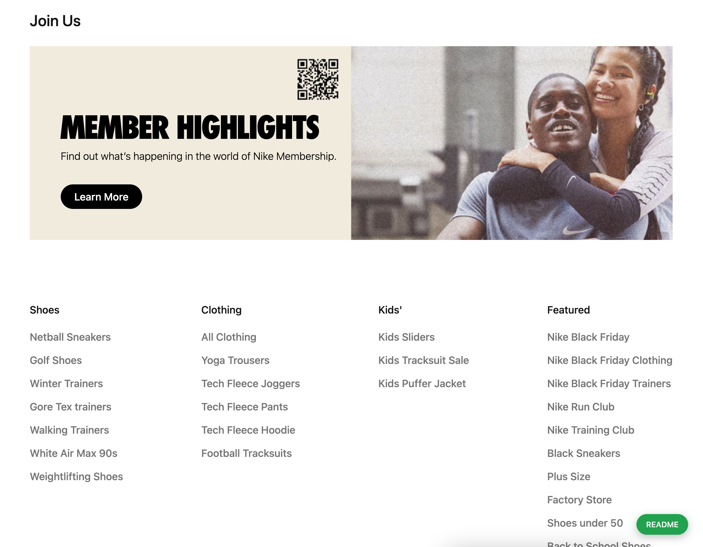

# Layout (Completed)

## Sumary

`Layout` is a **_flexible UI_**, which uses data from api to config the layout.

`Layout` allow to manage directly the layout without update source code. The page can has many dinamic layouts but use only one source code

**_Layers_**: Grid, Row, Column, Block, Card

Check **_Data Structures_** for more informations

[Quick access](https://nike-clone.cf/men)

## Data Structures

**_Data source_**: [nike.com](https://nike.com/gb)

`layouts`

```js
{
  pageUrlPaths: string, // the path of page url
  detail: {
    mode: 'layout',
    items: string[], // the list of Grid's uid. Each items is a part of page
    ... // configs of layout
  }
}
```

`layout_items`

```js
{
  mode: 'grid | row | col | block',
  layoutCardUid?: string, //Card's uid. Only have value in Block items
  detail: {
    mode: 'layout',
    items: string[], // the list of [Row | Col | Block]'s uid. They are the nested child
    data: string, // the Card's uid
    ... // configs of layout_item
  }
}
```

`layout_cards`

```js
{
  mode: 'card',
  detail: {
    containerType: string, // the kind of Card's layout
    actionButtons: Object[], // the list of buttons will be displayed in Card
    titleProps: Object, // configs of Card's title
    subTitleProps: Object, // configs of Card's sub title
    bodyProps: Object, // configs of Card's body
    textLocation: Object, // configs of text's layer in Card
    ... // configs of layout_card
  }
}
```

## Screenshots






