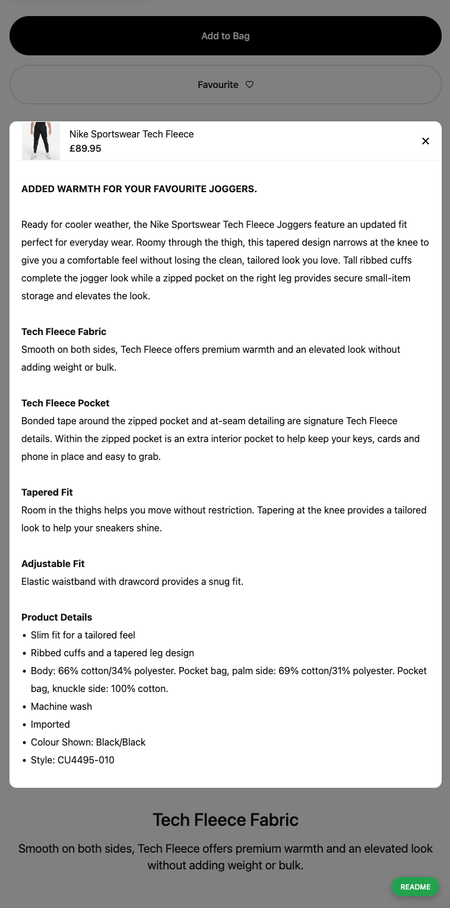

# Product Detail (Completed)

## Sumary

`Product Detail` is not only a **_fixed UI_** but also **_flexible UI_**

`Product Detail` displays product's image via **_nodes_**

Because of the limited disk-space in VPS, there are only **_one record_** `product_detail` in database.

Check `Data Structures` for more informations

<b>Strongly focus points:</b> structuring data, reusable and maintainable

[Quick access](https://nike-clone.cf/d/CU4495-010)

## Screenshots

- Desktop

- Mobile

