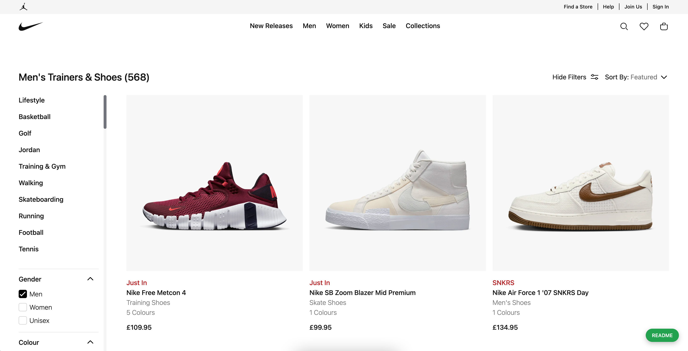
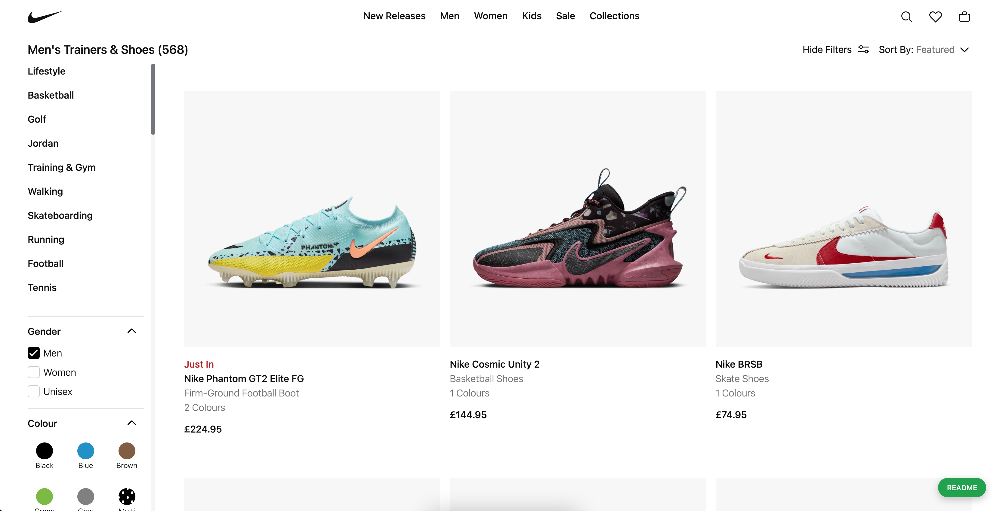
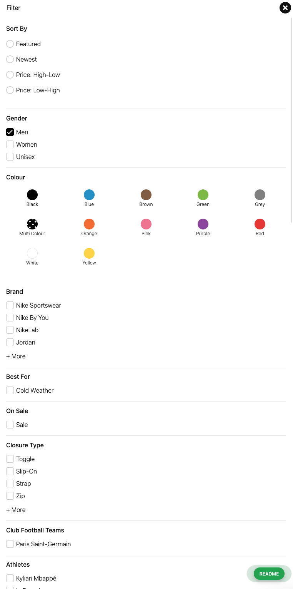
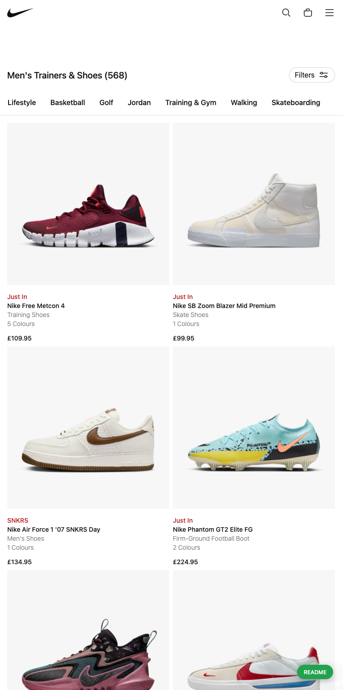

# Products (Completed)

## Sumary

`Products` is a **_fixed UI_**, which is always display the same layout for all data

All the most of behaviors were built in the same with [nike.com](https://nike.com/gb). However, a few behaviors were changed to make better UX/UI like:

- <b>Query products at client-side:</b> reduce the data's size from server-side, allow to apply `react-loading-skeleton`
- <b>Query products asynchronous:</b> Products api will be call while NextJS is waiting for `getServerSideProps`

<b>Strongly focus points:</b> handling animations, optimizing performance, structuring data, reusable and maintainable

[Quick access](https://nike-clone.cf/p/men-shoes-all-shoes/qjr7qk76zM/81BXZO1Df5VPPWRR4TVz)

## Screenshots

- Desktop

- Mobile

