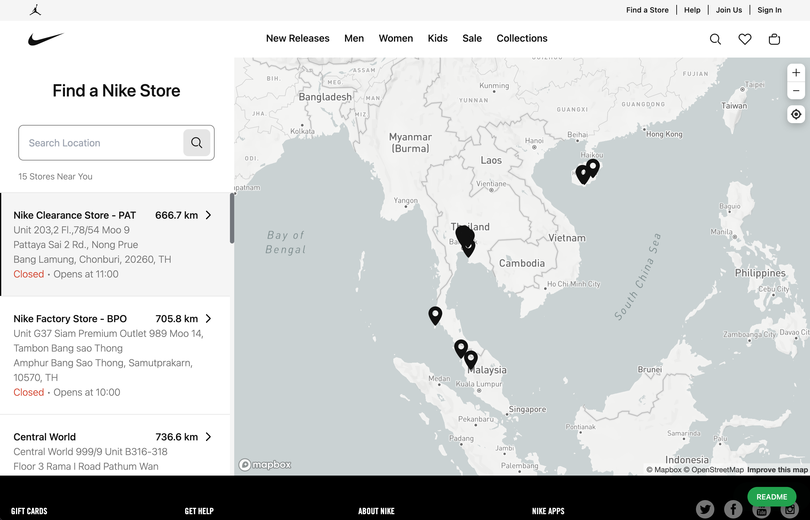
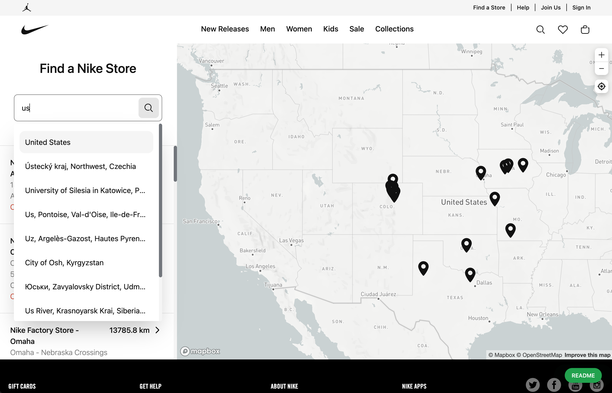
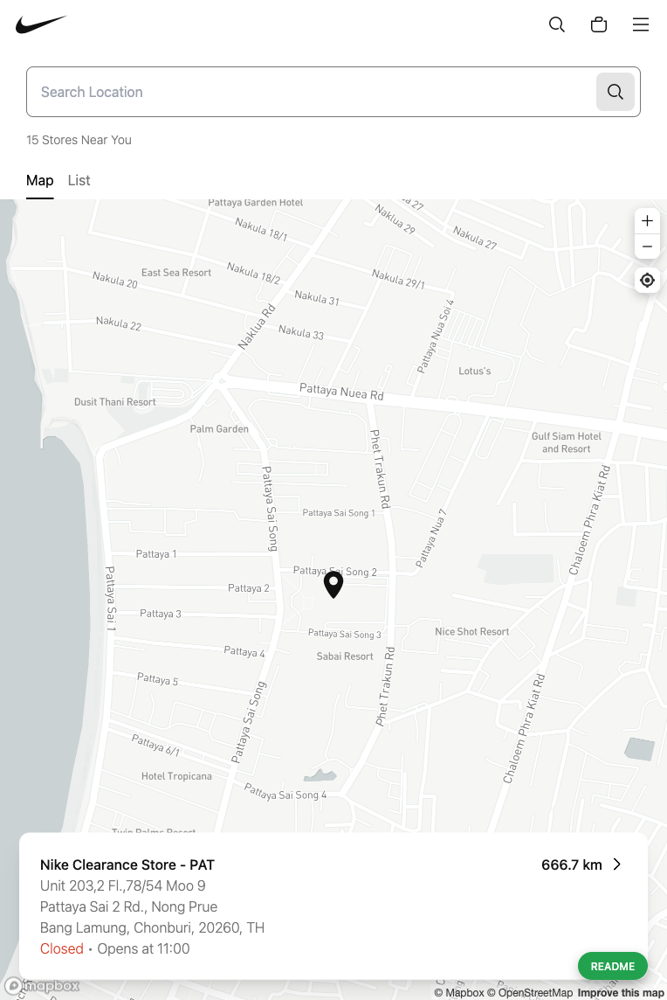
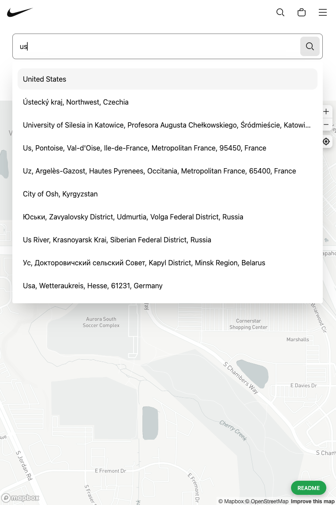

# Retail Map (Completed)

## Sumary

<b>Strongly focus points:</b> optimizing performance

<!-- [Quick access](https://nike.com/gb) -->

## Work flows

<b>Data source:</b> [nike.com](https://nike.com/gb), [openstreetmap.org](https://nominatim.openstreetmap.org)

### Load page:

- Load all `retail's coordinates` from api (without detail)
- Filter limitedly the `closest retails` with user's location
- Get the detail of `closest retails` from api
- Display them on the screen

### Search:

- Get place list from [openstreetmap.org](https://nominatim.openstreetmap.org) api, pick the first one as `search center`
- Get all `closest retails` with `search center`
- Display them on the screen

### Select a searched point:

- Pick selected point from place list as `search center`
- Get all `closest retails` with `search center`
- Display them on the screen

## Screenshots

- Desktop

- Mobile

